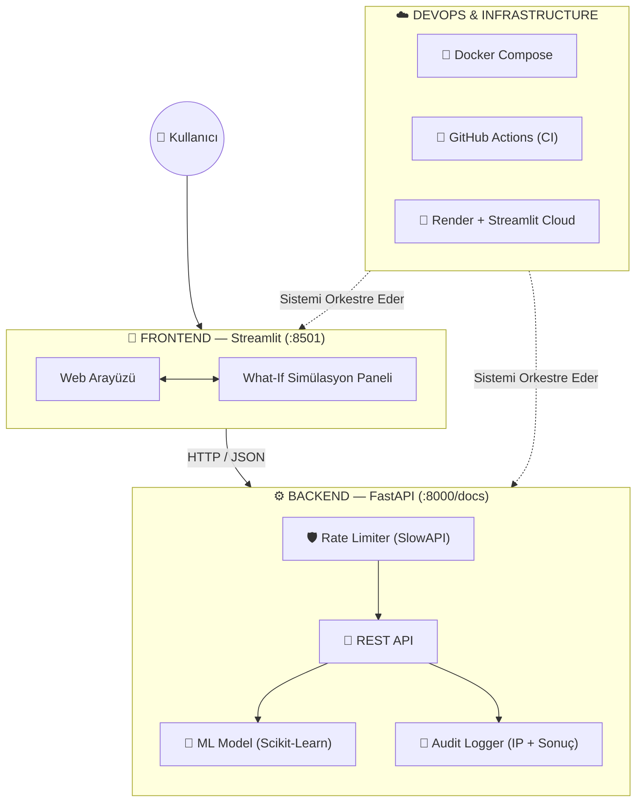

<div align="center">

# 🚀 Telco Churn Prediction System

### Telekomünikasyon Şirketleri için Uçtan Uca Müşteri Kaybı (Churn) Tahmin Sistemi

[](https://www.python.org/)
[](https://fastapi.tiangolo.com/)
[](https://streamlit.io/)
[](https://www.docker.com/)
[](https://scikit-learn.org/)

[](https://github.com/KULLANICI_ADIN/churn-prediction-project/actions)
[](LICENSE)


Müşteri verilerini analiz ederek churn riskini önceden tespit eden, karar destek mekanizmaları sunan, modern yazılım mühendisliği standartlarına (mikroservis mimarisi, CI/CD, konteynerizasyon) uygun geliştirilmiş ve canlıya alınmış bir makine öğrenmesi sistemi.

[🔴 Canlı Demo](#-canlı-sistem-live-demo) · [⚙️ Kurulum](#️-kurulum-lokal-ortam) · [🛠️ Tech Stack](#️-teknoloji-yığını-tech-stack) · [👥 Ekip](#-geliştirici-ekibi)

</div>

---

## 📌 İçindekiler

- [Genel Bakış](#-genel-bakış)
- [Temel Özellikler](#-temel-özellikler)
- [Sistem Mimarisi](#-sistem-mimarisi)
- [Teknoloji Yığını](#️-teknoloji-yığını-tech-stack)
- [Canlı Sistem](#-canlı-sistem-live-demo)
- [Kurulum](#️-kurulum-lokal-ortam)
- [Kullanım](#-kullanım)
- [Proje Yapısı](#-proje-yapısı)
- [Geliştirici Ekibi](#-geliştirici-ekibi)

---

## 📖 Genel Bakış

**Telco Churn Prediction System**, telekom operatörlerinin müşteri kaybını önceden öngörmesini ve veriye dayalı aksiyon almasını sağlayan uçtan uca bir MLOps projesidir. Sistem; bir makine öğrenmesi modelini üretim ortamına taşıyan güvenli bir API, karar destek sağlayan interaktif bir arayüz ve tüm süreci otomatikleştiren bir CI/CD hattından oluşur.

## 🌟 Temel Özellikler

| Özellik | Açıklama |
|---|---|
| 🎯 **Risk Analizi** | Müşteri verilerini analiz ederek **%75 doğruluk** oranıyla churn olasılığını hesaplar |
| 🔮 **What-If Simülasyonu** | *"Aylık ücreti %10 düşürürsek risk ne kadar azalır?"* gibi senaryoları canlı simüle eden interaktif karar destek arayüzü |
| 🛡️ **Rate Limiting** | API uç noktaları IP tabanlı hız sınırlandırıcı ile DDoS ve bot saldırılarına karşı korunur |
| 📝 **Audit Logging** | Gelen tüm tahmin istekleri, IP adresi ve model sonuçlarıyla birlikte kalıcı olarak loglanır |
| 🔄 **CI/CD** | GitHub Actions ile her güncellemede uç durum testleri (Pytest) otomatik çalıştırılır |
| 🐳 **Platform Bağımsızlık** | Docker & Docker Compose sayesinde işletim sisteminden bağımsız, saniyeler içinde ayağa kalkar |

## 🏗️ Sistem Mimarisi



## 🛠️ Teknoloji Yığını (Tech Stack)

<table>
<tr>
<td valign="top" width="33%">

**⚙️ Backend API**
- Python 3.11
- FastAPI
- Pydantic V2
- SlowAPI
- Pytest

</td>
<td valign="top" width="33%">

**🎨 Frontend**
- Streamlit

**🧠 Makine Öğrenmesi**
- Scikit-Learn
- Pandas

</td>
<td valign="top" width="33%">

**☁️ DevOps & MLOps**
- Docker / Docker Compose
- GitHub Actions
- Render (API Sunucusu)
- Streamlit Cloud

</td>
</tr>
</table>

## 🔴 Canlı Sistem (Live Demo)

Sistem bulut üzerinde **7/24 aktif** olarak çalışmaktadır:

| Servis | Bağlantı |
|---|---|
| 🖥️ Kullanıcı Arayüzü (Frontend) | [Streamlit Uygulaması](https://churn-prediction-hgxujnzhaxsakrubednrwc.streamlit.app) |
| 📡 API Swagger UI (Backend) | [Render API Docs](https://churn-prediction-api-vbld.onrender.com) |

## ⚙️ Kurulum (Lokal Ortam)

Projeyi kendi bilgisayarınızda çalıştırmak için sisteminizde yalnızca **Docker** ve **Docker Compose** kurulu olması yeterlidir. Ayrı bir sanal ortam veya Python kurulumuna gerek yoktur.

### 1️⃣ Repoyu Klonlayın

```bash
git clone https://github.com/efeyigitaltun/churn-prediction.git
cd churn-prediction-project
```

### 2️⃣ Sistemi Ayağa Kaldırın

```bash
docker-compose up --build
```

### 3️⃣ Servislere Erişin

| Servis | Adres |
|---|---|
| 🎨 Web Arayüzü (Frontend) | http://localhost:8501 |
| 📘 API Dokümantasyonu (Swagger) | http://localhost:8000/docs |

## 💡 Kullanım

1. Frontend arayüzünden müşteri bilgilerini (sözleşme tipi, aylık ücret, kullanım süresi vb.) girin.
2. **"Tahmin Et"** butonuna basarak churn riskini görüntüleyin.
3. **What-If** panelinden değişkenleri (örn. aylık ücret, kontrat süresi) değiştirerek riskin nasıl değiştiğini canlı olarak gözlemleyin.
4. Sonuçlar backend tarafından otomatik olarak loglanır ve denetlenebilir.

## 📂 Proje Yapısı

```
churn-prediction-project/
│
├── 📁 src/                          # FastAPI servisi (Backend)
│   ├── 🐍 app.py                     # API giriş noktası, Rate Limiting ve Loglama
│   ├── 🧪 test_app.py                # Pytest uç durum ve entegrasyon testleri
│   └── 📦 model.pkl                  # Eğitilmiş churn makine öğrenmesi modeli
│
├── 📁 frontend/                     # Streamlit arayüzü
│   ├── 🐍 app.py                     # Ana uygulama & What-If simülasyon paneli
│   └── 🐳 Dockerfile                 # Frontend için konteyner imaj tarifi
│
├── 📁 .github/
│   └── 📁 workflows/
│       └── ⚡ ci.yml                 # GitHub Actions CI/CD pipeline tanımı
│
├── 🐳 Dockerfile                    # Backend için konteyner imaj tarifi
├── 🐳 docker-compose.yml            # Servis orkestrasyonu ve ağ yapılandırması
├── 📄 requirements.txt              # Proje bağımlılıkları
└── 📘 README.md
```

## 👥 Geliştirici Ekibi

<table>
<tr>
<td align="center" width="50%">
<b>Efe Yiğit Altun</b><br/>
🏗️ Sistem Mimarisi<br/>
⚙️ Backend (FastAPI)<br/>
🧠 Model Entegrasyonu<br/>
🐳 DevOps (Docker, CI/CD)
</td>
<td align="center" width="50%">
<b>Osman Babayiğit</b><br/>
🎨 Frontend Geliştirme (Streamlit)<br/>
✨ UI/UX Tasarımı
</td>
</tr>
</table>

---

<div align="center">

⭐️ Projeyi beğendiyseniz bir yıldız bırakmayı unutmayın!

</div>